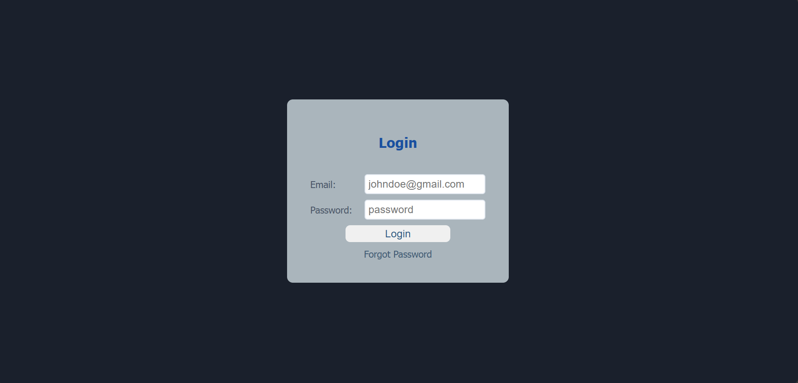

# Day 11 - Learn about CSS

- Building a web project - Login page

- Masterclass on CSS selectors

## Topic - 1: Building a web project - Login page

A simple and clean **Login Page** built using **HTML and CSS**, created to practice form structure, alignment, and layout styling using Flexbox.

**Project Overview**

This mini-project focuses on:

- Structuring a semantic login form

- Aligning labels & input fields

- Centering the card using Flexbox

- Button styling and positioning

- Adding a functional-looking "Forgot Password" link

- Improving UI spacing, readability, and color design

**Features Implemented**

- Card aligned at the center using `flexbox`

- Labels and inputs aligned in a single row using flex layout

- Proportional spacing using width assignments (30% / 70%) for labels and inputs

- Styled login button with clear CTA

- Placeholder and required validation added

- Clickable “Forgot Password” link (dummy link)

- Consistent theme with rounded corners

**Challenges Faced & Their Solutions**

| Challenge                      | Issue Faced                                     | Solution                                                                                                                |
| ------------------------------ | ----------------------------------------------- | ----------------------------------------------------------------------------------------------------------------------- |
| Label & Input Alignment        | Inputs were not aligned properly next to labels | Wrapped each label-input pair in `.form-group` and used `display: flex` with `width: 30%` for labels & `70%` for inputs |
| Button Centering               | The Login button was misaligned                 | Placed it within the form and applied width and flex layout consistency                                                 |
| Forgot Password Link Placement | Link appeared misplaced or beside button        | Enclosed it in a separate `<div>` below the button inside the form                                                      |
| Centering the Login Card       | Card was stuck at the top of the page           | Used `display: flex`, `justify-content: center`, `align-items: center` on `body` with `height: 100vh`                   |
| Proper Spacing Between Fields  | Inputs and labels were too close                | Added `gap` property in `.form-group` and spacing in `form`                                                             |

**Technologies Used**

| Technology | Purpose                              |
| ---------- | ------------------------------------ |
| HTML       | Form structure and content           |
| CSS        | Styling and layout management        |
| Flexbox    | Alignment and responsive positioning |

**What I Learned**

- Using **Flexbox** for horizontal and vertical alignment

- Assigning **proportional widths (30%-70%)** for labels and inputs

- Assigning width proportions for better layout control

- Improving readability with padding and gaps

- Structuring forms for usability and clean UI

- Adding accessibility using `label for=""` and `required` attributes

**Project Preview**

- [Login-page](./assets/login-page.png)
  

**Future Improvements**

- Add hover effects to the Login button

- Apply box-shadow for depth

- Use icons in input fields

- Make layout fully mobile responsive

- Connect form with backend (future integration project)

---

## Topic - 2: Masterclass on CSS selectors

CSS Selectors define **which HTML elements** a style rule applies to.

Tip: Always try to **read selectors from right to left** for better understanding and performance.

**1. Universal Selector (`*`)**

Targets **all HTML elements**.

```css
* {
  margin: 0;
  padding: 0;
  box-sizing: border-box;
}
```

**2. Type (Tag) Selector**

Targets elements by their tag name.

```css
p {
  font-size: 16px;
  margin-bottom: 10px;
}
```

**3. Class Selector (.)**

Targets elements with a specific class attribute.

```css
.highlight {
  background-color: #21a2c9;
}
```

**4. ID Selector (#)**

Targets a specific element with a unique ID.

```css
#header {
  background-color: #860303;
  color: rgb(191, 200, 90);
}
```

**5. Attribute Selector ([attribute=value])**

Targets elements based on the presence and value of an attribute.

```css
input[type="text"] {
  border: 2px solid #21a2c9;
}
```

**6. Descendant Selector ( )**

Targets elements inside (at any level) a parent element.

```css
article p {
  font-style: italic;
  background-color: #1a1a1a;
  color: #fff;
  padding: 10px;
}
```

**7. Child Selector (>)**

Targets elements that are direct children of a parent.

```css
ul > li {
  background-color: burlywood;
  list-style-type: disc;
}
```

**8. Adjacent Sibling Selector (+)**

Targets an element that is the immediate next sibling of another.

```css
h1 + p {
  font-weight: bold;
  background-color: #162529;
  color: aliceblue;
}
```

**9. General Sibling Selector (~)**

Targets all siblings after a specified element.

```css
h2 ~ p {
  color: #860303;
  font-weight: bolder;
}
```

**10. Pseudo-class Selector (:)**

Targets elements in a specific state.

```css
a:hover {
  background-color: #14a50e;
  text-decoration: none;
  color: #1a1a1a;
  padding: 5px;
  margin: 4px;
}
```

**11. Pseudo-element Selector (::)**

Targets a specific part of an element.

```css
p::first-letter {
  font-weight: bold;
  font-size: 30px;
}
```

**12. Grouping Selector (,)**

Applies the same styles to multiple selectors.

```css
h1,
h2,
h3 {
  color: orange;
}
```

---

## Additional Selectors

**Here are a few more commonly used selectors:":**

**Pseudo-Class Selectors (State-based)**

| **Example**      | **Use Case**                                |
| ---------------- | ------------------------------------------- |
| `button:hover`   | When the mouse is over a button             |
| `input:focus`    | When an input field is clicked/focused      |
| `input:required` | Targets required fields in a form           |
| `a:visited`      | Styles links that have already been visited |

---

**Pseudo-Element Selectors (Part of an Element)**

| **Example**       | **What It Does**                          |
| ----------------- | ----------------------------------------- |
| `p::first-line`   | Styles only the first line of a paragraph |
| `p::first-letter` | Styles the first letter of a paragraph    |
| `button::before`  | Inserts content before the element        |
| `button::after`   | Inserts content after the element         |

---

**Attribute Selectors (Powerful!)**

| **Selector**          | **Targets**                          |
| --------------------- | ------------------------------------ |
| `input[type="email"]` | Selects only email input fields      |
| `a[target="_blank"]`  | Selects links that open in a new tab |

---

## Bonus: CSS Specificity (Lowest → Highest)

| Selector Type                                 | Example                           | Specificity |
| --------------------------------------------- | --------------------------------- | ----------- |
| **Universal Selector**                        | `*`                               | Lowest      |
| **Type Selector**                             | `p`, `div`                        | Medium      |
| **Class / Attribute / Pseudo-class Selector** | `.btn`, `[type="text"]`, `:hover` | High        |
| **ID Selector**                               | `#main`                           | Higher      |
| **Inline CSS**                                | `style=""`                        | Highest     |
