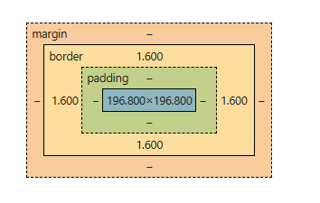

# Day 12 - Learn about CSS

- Box model, inline and block elements

- Navbar project with Pseudo element

---

## Topic 1: Box model, inline and block elements

- Code Files

  - **[Box model, inline and block elements](./Topic-01_Box-Model-Inline-Block-Elements/box-model.html)**

---

### Box Model:

The Box Model is a fundamental concept that defines how every HTML element is visually structured and takes up space on a webpage.

Every element is treated as a rectangular box composed of four distinct areas that control its size, position, and spacing.



**Four Key Areas:**

1. **Content:**

   - The actual text, image, video, or data inside the box
   - Controlled by `width` and `height` properties

2. **Padding:**

   - Invisible space between content and border (internal spacing)
   - Creates breathing room inside the element
   - Properties: `padding-top`, `padding-right`, `padding-bottom`, `padding-left`

3. **Border:**

   - A visible line around the padding and content (still inside the element)
   - Properties: `border-width`, `border-style`, `border-color`

4. **Margin:**
   - Space outside the border (external spacing between elements)
   - Creates distance from other elements
   - Properties: `margin-top`, `margin-right`, `margin-bottom`, `margin-left`

**Fill Area:**

The area filled with `background color` or `background image` (includes content + padding, but **not** margin).

**Box Sizing Property:**

CSS provides two ways to calculate box dimensions:

**1. Content-box (default):**

```css
box-sizing: content-box;
```

- Width/height applies **only to content**

- Padding and border are **added** to the specified dimensions

- Makes final size larger than specified width/height

**2. Border-box ✅ (recommended):**

```css
box-sizing: border-box;
```

- Width/height includes **content + padding + border**

- No extra expansion beyond specified dimensions

- What you set is what you get

- **Best practice:** Apply to all elements with `* { box-sizing: border-box; }`

**How Box Model calculate size:**

Given these CSS properties:

```css
.box {
  width: 200px;
  padding: 20px;
  border: 5px solid black;
  height: 100px;
}
```

**With content-box (default):**

**Final element width:**

```
Left Border + Left Padding + Content Width + Right Padding + Right Border
5px + 20px + 200px + 20px + 5px = 250px
```

**Final element height:**

```
Top Border + Top Padding + Content Height + Bottom Padding + Bottom Border
5px + 20px + 100px + 20px + 5px = 150px
```

**With border-box:**

```css
* {
  box-sizing: border-box;
}
```

- **Final width:** Exactly 200px (as specified)
- **Final height:** Exactly 100px (as specified)
- Padding and border are included within these dimensions

**Code Example:**

```html
<div class="box">This is a box</div>
```

```css
* {
  /* Apply border-box to all elements (best practice) */
  box-sizing: border-box;
}

.box {
  width: 200px;
  height: 100px;
  padding: 20px;
  border: 5px solid black;
  margin: 15px;
  background-color: lightgray;
}
```

```
With border-box:

- Total width: 200px (including padding + border)
- Total height: 100px (including padding + border)
- Content area adjusts automatically

```

---

### Inline and Block elements

CSS provides different display types that control how elements behave in the document flow.

**Block-Level Elements:**

Elements that take up the full width available and stack vertically.

**Characteristics:**

- Elements formatted visually as blocks
- Occupy 100% of parent element's width (by default)
- Stack vertically, one after another
- Full box model applies (width, height, padding, margin all work)
- Force new lines before and after

**Default Block Elements:**

```
Structural: body, main, header, footer, section, nav, aside, article
Containers: div, form, fieldset
Headings: h1, h2, h3, h4, h5, h6
Text blocks: p, blockquote, pre, hr
Lists: ul, ol, li, dl, dt, dd
Tables: table, thead, tbody, tr

```

**With CSS:**

```css
display: block;
```

**Inline Elements:**

Elements that only take up as much width as necessary and flow with text.

**Characteristics:**

- Occupy only the space necessary for content
- Do NOT cause line-breaks (flow with text)
- Box model applies differently:
  - Width and height do **not** apply
  - Padding and margins only work horizontally (left/right)
  - Vertical padding is applied but doesn't affect layout
  - Vertical margins are ignored

**Default Inline Elements:**

```
Links:          a
Text styling:   strong, em, span, code, small, sub, sup, mark
Form elements:  label
```

**With CSS:**

```css
display: inline;
```

**Inline-Block Elements:**

The best of both worlds - flows like inline but behaves like block.

**Characteristics:**

- Looks like inline from the outside (sits in line with text)
- Behaves like block on the inside (accepts width/height)
- Occupies only content's space (can set custom width/height)
- Causes NO line-breaks
- Full box model applies (all padding and margins work)

**Default Inline-Block Elements:**

```
Media:         img (inline by default, but behaves like inline-block)
Form elements: button, input, select, textarea
```

**With CSS:**

```css
display: inline-block;
```

**Comparison:**

| Property              | Block                                 | Inline-Block                                                               | Inline                                           |
| --------------------- | ------------------------------------- | -------------------------------------------------------------------------- | ------------------------------------------------ |
| **Element Formation** | Elements formatted visually as blocks | Looks like inline from the outside, behaves like block level on the inside | Occupies only content's space                    |
| **Width & Height**    | Works (default: 100%)                 | Works (shrinks to content)                                                 | Doesn't work                                     |
| **Padding**           | All sides                             | All sides                                                                  | Left/right only (vertical doesn't affect layout) |
| **Margin**            | All sides                             | All sides                                                                  | Left/right only (vertical ignored)               |
| **Line Breaks**       | Creates new lines                     | No line breaks                                                             | No line breaks                                   |
| **Stacking**          | Vertical (one per line)               | Horizontal (if space allows)                                               | Horizontal (flows with text)                     |
| **Use Case**          | Layout sections, containers           | Navigation items, buttons, cards                                           | Text styling, links within paragraphs            |

**Visual Summary:**

```

BLOCK: [████████████████████████] ← Full width
[████████████████████████]

INLINE-BLOCK: [█████] [████████] [██] ← Content width, no breaks

INLINE: text [█] more text [███] ← Flows with text

```

**Key Differences:**

**Block-Level Boxes**

- Elements formatted visually as blocks
- Take 100% of parent width
- Stack vertically, one after another
- Full box model applies
- `display: block`

**Inline-Block Boxes**

- Looks like inline from the outside
- Behaves like block on the inside
- Occupies only content's space
- Causes no line-breaks
- Full box model applies
- `display: inline-block`

**Inline Boxes**

- Occupies only content's space
- Causes no line-breaks
- Box model is different:
  - Height and width do **not** apply
  - Padding and margins only horizontal (left & right)
- `display: inline`

**Practical Example:**

```html
<div class="container">
  <!-- Block: takes full width -->
  <h2>Welcome to CSS</h2>
  <!-- Block: full width, new line -->

  <p>
    <!-- Block: paragraph -->
    This is <strong>bold text</strong>
    <!-- Inline: flows with text -->
    and here's a <a href="#">link</a>.
    <!-- Inline: flows with text -->
  </p>

  <nav>
    <!-- Block: navigation container -->
    <a href="#" class="nav-item">Home</a>
    <!-- Inline-block: sits in row -->
    <a href="#" class="nav-item">About</a>
    <a href="#" class="nav-item">Contact</a>
  </nav>

  <button>Click Me</button>
  <!-- Inline-block by default -->
</div>
```

```css
.container {
  display: block;
  max-width: 1200px;
  margin: 0 auto;
}

.nav-item {
  display: inline-block; /* Converts link to inline-block */
  padding: 10px 20px; /* Now all padding works */
  margin: 0 5px; /* Now all margin works */
  width: 100px; /* Width now applies */
}
```

**Common Use Cases:**

**When to use Block:**

- Page layout sections (header, footer, sidebar)
- Container elements (`<div>`)
- Text blocks and headings
- Elements that should stack vertically
- Forms and form sections

**When to use Inline:**

- Text styling within paragraphs (`<strong>`, `<em>`)
- Links within text
- Small icons or badges
- Elements that should flow naturally with content

**When to use Inline-Block:**

- Navigation menu items (horizontal nav)
- Buttons in a row
- Image galleries
- Cards that should sit side-by-side
- Form elements that need precise sizing
- Icons with specific dimensions

**Common Pitfalls & Solutions:**

**Pitfall 1: Setting width/height on inline elements**

```css
/* This won't work! */
span {
  width: 200px; /* Ignored */
  height: 100px; /* Ignored */
}
```

**Solution:** Convert to inline-block or block

```css
span {
  display: inline-block;
  width: 200px; /* Now it works! */
  height: 100px;
}
```

**Pitfall 2: Vertical spacing on inline elements**

```css
/* Only left/right work, top/bottom ignored */
a {
  margin: 20px 0; /* Top/bottom margins don't work */
}
```

**Solution:** Use inline-block or padding

```css
a {
  display: inline-block;
  margin: 20px 0; /* Now all margins work */
}

/* OR use padding (works on inline) */
a {
  padding: 20px 0; /* Padding is applied but doesn't affect line height */
}
```

**Pitfall 3: Gaps between inline-block elements**

```html
<div class="nav">
  <a href="#">Home</a>
  <a href="#">About</a>
  <a href="#">Contact</a>
</div>
```

```css
a {
  display: inline-block;
  /* Unexpected 4px gaps appear between elements! */
}
```

**Solution:** Remove whitespace in HTML or use flexbox

```html
<!-- Option 1: Remove whitespace -->
<div class="nav">
  <a href="#">Home</a><a href="#">About</a><a href="#">Contact</a>
</div>

<!-- Option 2: Use flexbox (modern approach) -->
<div class="nav">
  <a href="#">Home</a>
  <a href="#">About</a>
  <a href="#">Contact</a>
</div>
```

```css
.nav {
  display: flex;
  gap: 10px; /* Better than inline-block for layouts */
}
```

**Key Takeaways:**

1. **Always use `box-sizing: border-box`** for predictable sizing
2. **Block elements** stack vertically and take full width
3. **Inline elements** flow with text but have limited box model support
4. **Inline-block** combines benefits of both
5. Use **Flexbox or Grid** for modern layouts instead of inline-block
6. Understand which properties work with each display type
7. Choose the right display type based on your layout needs

---

## Topic 2: Navbar Project with Pseudo-elements

- Code Files

  - **[Navbar Project with Pseudo-elements](./Topic-02_Navbar-Project-With-Psuedo-Element/navbar.html)**

---

## What are Pseudo-elements?

**Pseudo-elements** are special CSS selectors that let you style specific parts of an element or create "virtual" elements without adding extra HTML.

**Key characteristics:**

- They don't exist in the HTML (generated by CSS)
- Use double colon syntax: `::before`, `::after` (modern)
- Can also use single colon: `:before`, `:after` (legacy, still works)
- Allow you to add decorative content without cluttering HTML
- Are inline by default (can be changed with `display` property)

**Syntax:**

```css
selector::pseudo-element {
  property: value;
}
```

**Common Pseudo-elements:**

**1. `::before`**

Creates a pseudo-element that is the **first child** of the selected element.

**Characteristics:**

- Appears before the element's actual content
- Requires `content` property (even if empty)
- Inline by default
- Perfect for icons, decorative elements, or prefixes

**Example:**

```css
.item::before {
  content: "abc";
  color: blue;
  font-weight: bold;
}
```

```html
<p class="item">Click here</p>
<!-- Renders as: abc Click here -->
```

**2. `::after`**

Creates a pseudo-element that is the **last child** of the selected element.

**Characteristics:**

- Appears after the element's actual content
- Requires `content` property (even if empty)
- Inline by default
- Perfect for icons, decorative elements, or suffixes

**Example:**

```css
.link::after {
  content: " ↗";
  font-size: 12px;
  color: gray;
}
```

```html
<a href="#" class="link">External Link</a>
<!-- Renders as: External Link ↗ -->
```

**3. `::first-letter`**

Styles the first letter of a block-level element.

**Example:**

```css
p::first-letter {
  font-size: 2em;
  font-weight: bold;
  color: #667eea;
}
```

**4. `::first-line`**

Styles the first line of a block-level element.

**Example:**

```css
p::first-line {
  font-weight: bold;
  text-transform: uppercase;
}
```

**5. `::selection`**

Styles the portion of text selected by the user.

**Example:**

```css
::selection {
  background-color: #667eea;
  color: white;
}
```

**`::before` vs `::after` - When to Use?**

| Use Case                          | Recommended            | Example             |
| --------------------------------- | ---------------------- | ------------------- |
| **Icon before text**              | `::before`             | `→ Menu Item`       |
| **Icon after text**               | `::after`              | `External Link ↗`   |
| **Prefix/Label**                  | `::before`             | `NEW: Product`      |
| **Decorative line under element** | `::after`              | Underline animation |
| **Quote marks**                   | `::before` & `::after` | `"Quote text"`      |
| **Clearfix**                      | `::after`              | Clear floats        |

**Required: The `content` Property**

**CRITICAL:** `::before` and `::after` **require** the `content` property, even if empty!

```css
/* ❌ Won't work - missing content */
.item::before {
  color: red;
}

/* ✅ Works - has content */
.item::before {
  content: ""; /* Empty content, but required */
  color: red;
}

/* ✅ Works - has text content */
.item::before {
  content: "→";
  color: red;
}

/* ✅ Works - uses attribute value */
.link::after {
  content: attr(href); /* Displays the href value */
}
```

**Pseudo-elements in Navigation Menus**

Pseudo-elements are perfect for creating interactive navigation effects!

**Example 1: Underline on Hover**

```html
<nav>
  <ul class="nav-menu">
    <li><a href="#" class="nav-link">Home</a></li>
    <li><a href="#" class="nav-link">About</a></li>
    <li><a href="#" class="nav-link">Services</a></li>
    <li><a href="#" class="nav-link">Contact</a></li>
  </ul>
</nav>
```

```css
.nav-link {
  position: relative;
  text-decoration: none;
  color: #333;
  padding: 10px 20px;
  display: inline-block;
}

/* Create invisible underline */
.nav-link::after {
  content: "";
  position: absolute;
  bottom: 0;
  left: 0;
  width: 0%;
  height: 2px;
  background-color: #667eea;
  transition: width 0.3s ease;
}

/* Expand underline on hover */
.nav-link:hover::after {
  width: 100%;
}
```

**Result:** Smooth animated underline that appears on hover! ✨

**Example 2: Icon Before Menu Items**

```css
.nav-link::before {
  content: "▸ ";
  opacity: 0;
  margin-right: 5px;
  transition: opacity 0.3s ease;
}

.nav-link:hover::before {
  opacity: 1;
}
```

**Result:** Arrow icon fades in on hover!

**Example 3: Active Link Indicator**

```css
.nav-link.active {
  color: #667eea;
}

.nav-link.active::before {
  content: "●";
  margin-right: 8px;
  color: #667eea;
}
```

```html
<a href="#" class="nav-link active">Home</a>
<!-- Renders as: ● Home -->
```

**Display Property for Pseudo-elements**

**By default:** `::before` and `::after` are **inline** elements.

For complex styling, you often need to change their display:

```css
/* Making pseudo-element a block for positioning */
.item::before {
  content: "";
  display: block; /* Now it behaves like a block element */
  width: 100%;
  height: 2px;
  background: blue;
}

/* Making it inline-block for sizing */
.item::after {
  content: "NEW";
  display: inline-block; /* Can now set width/height */
  width: 40px;
  padding: 2px 5px;
  background: red;
  color: white;
}

/* Making it absolutely positioned */
.item::before {
  content: "";
  position: absolute; /* Takes it out of flow */
  top: 0;
  left: 0;
  width: 100%;
  height: 100%;
  background: rgba(0, 0, 0, 0.5);
}
```

**Best Practices for Pseudo-elements**

✅ **DO:**

- Always include `content` property (even if empty: `content: ""`)
- Use for **decorative** elements, not essential content
- Use double colon `::` (modern syntax)
- Make them invisible to screen readers (they are by default)
- Use for hover effects, icons, and decorative lines

❌ **DON'T:**

- Put important text content in pseudo-elements (bad for accessibility)
- Use for essential navigation or interactive elements
- Forget the `content` property (element won't render)
- Overuse them (keep HTML clean but not invisible)

**Common Navbar Use Cases:**

**1. Hover Effects:**

```css
/* Animated underline */
.nav-link::after {
  content: "";
  display: block;
  width: 0;
  height: 2px;
  background: #667eea;
  transition: width 0.3s;
}

.nav-link:hover::after {
  width: 100%;
}
```

**2. Active State Indicators:**

```css
.nav-link.active::before {
  content: "";
  display: inline-block;
  width: 8px;
  height: 8px;
  background: #667eea;
  border-radius: 50%;
  margin-right: 10px;
}
```

**3. Dropdown Indicators:**

```css
.dropdown::after {
  content: "▼";
  margin-left: 5px;
  font-size: 10px;
  transition: transform 0.3s;
}

.dropdown:hover::after {
  transform: rotate(180deg);
}
```

**4. Separators Between Items:**

```css
.nav-item:not(:last-child)::after {
  content: "|";
  margin: 0 10px;
  color: #ccc;
}
```

---

**Practical Navbar Project Example:**

```html
<!DOCTYPE html>
<html lang="en">
  <head>
    <meta charset="UTF-8" />
    <meta name="viewport" content="width=device-width, initial-scale=1.0" />
    <title>Navbar with Pseudo-elements</title>
    <style>
      * {
        margin: 0;
        padding: 0;
        box-sizing: border-box;
      }

      body {
        font-family: "Segoe UI", Tahoma, Geneva, Verdana, sans-serif;
      }

      nav {
        background: #1a202c;
        padding: 1rem 2rem;
      }

      .nav-menu {
        list-style: none;
        display: flex;
        gap: 2rem;
      }

      .nav-link {
        color: white;
        text-decoration: none;
        padding: 0.5rem 1rem;
        position: relative;
        display: inline-block;
        transition: color 0.3s;
      }

      /* Animated underline using ::after */
      .nav-link::after {
        content: "";
        position: absolute;
        bottom: -5px;
        left: 50%;
        transform: translateX(-50%);
        width: 0;
        height: 2px;
        background: #667eea;
        transition: width 0.3s ease;
      }

      .nav-link:hover {
        color: #667eea;
      }

      .nav-link:hover::after {
        width: 100%;
      }

      /* Active link indicator using ::before */
      .nav-link.active::before {
        content: "";
        position: absolute;
        left: 0;
        top: 50%;
        transform: translateY(-50%);
        width: 4px;
        height: 70%;
        background: #667eea;
        border-radius: 2px;
      }

      .nav-link.active {
        color: #667eea;
        padding-left: 1.5rem;
      }
    </style>
  </head>
  <body>
    <nav>
      <ul class="nav-menu">
        <li><a href="#" class="nav-link active">Home</a></li>
        <li><a href="#" class="nav-link">About</a></li>
        <li><a href="#" class="nav-link">Services</a></li>
        <li><a href="#" class="nav-link">Portfolio</a></li>
        <li><a href="#" class="nav-link">Contact</a></li>
      </ul>
    </nav>
  </body>
</html>
```

**Features:**

- Animated underline on hover (using `::after`)
- Active state indicator (using `::before`)
- Smooth color transitions
- No extra HTML needed for effects

**Debugging Pseudo-elements**

**Common issues when pseudo-elements don't appear:**

1. **❌ Missing `content` property**

```css
/* Won't work */
.item::before {
  color: red;
}

/* ✅ Fixed */
.item::before {
  content: "";
  color: red;
}
```

2. **❌ Wrong display type for your use case**

```css
/* Inline by default - width/height won't work */
.item::after {
  content: "";
  width: 100px; /* Ignored! */
}

/* ✅ Fixed */
.item::after {
  content: "";
  display: block;
  width: 100px; /* Now it works */
}
```

3. **❌ Positioning issues**

```css
/* Pseudo-element hidden behind parent */
.item::before {
  content: "";
  position: absolute;
  /* Need positioning values! */
}

/* ✅ Fixed */
.item {
  position: relative; /* Create positioning context */
}
.item::before {
  content: "";
  position: absolute;
  top: 0;
  left: 0;
}
```

**Key Takeaways:**

1. Pseudo-elements create virtual elements without HTML
2. Always use `content` property (even if empty)
3. `::before` comes first, `::after` comes last
4. Inline by default, change with `display` property
5. Perfect for decorative effects in navigation
6. Use for hover animations, icons, and indicators
7. Don't put essential content in pseudo-elements (accessibility)

---

### 🐢 Learning Tip:

**"When learning or making projects, look for errors and hunt for them!"**

When your pseudo-element doesn't appear:

1. Check if `content` property exists
2. Check if `display` property is appropriate
3. Use browser DevTools to inspect (pseudo-elements show in Elements tab)
4. Verify positioning context (parent has `position: relative`)
5. Check z-index if overlapping with other elements

**Remember:** Pseudo-elements are CSS magic, they let you create visual effects without polluting your HTML

**Note:** For list itmes display inline it's a good practice

---

**Created with the Tortoise approach 🐢 - Slow, steady, and thorough**
